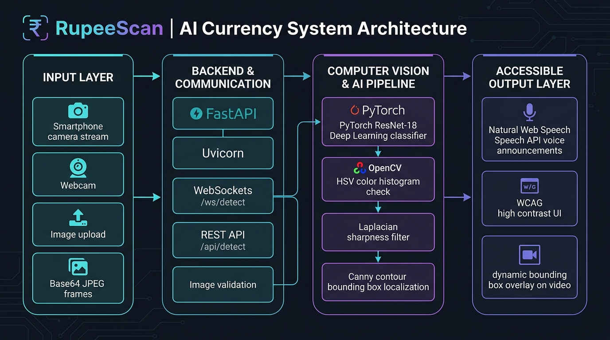
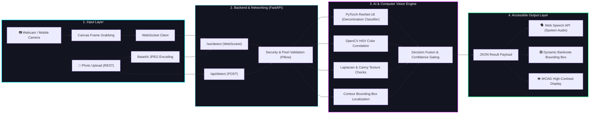

# RupeeScan 🔍🇮🇳

[](https://www.python.org/)
[](https://fastapi.tiangolo.com/)
[](https://pytorch.org/)
[](https://opencv.org/)
[](#accessibility-features)
[](#tests)

> **Empowering Financial Independence for the Visually Impaired through Real-Time Computer Vision.**

RupeeScan is an accessibility-first Indian banknote denomination assistant. Powered by a hybrid PyTorch ResNet-18 and OpenCV vision pipeline, it provides sub-10ms real-time banknote identification via live webcam streaming, image uploads, natural voice announcements, and WCAG-compliant high-contrast controls.

---

## 🌟 About Us & Project Mission

### Why RupeeScan?
In India, while modern banknotes feature tactile bleeding lines and variable sizes, individuals with visual impairments, partial blindness, or age-related vision loss frequently encounter challenges in everyday transactions. Variations in lighting, soiled or folded notes, and rapid merchant exchanges create barriers to financial autonomy.

**RupeeScan was built to solve this challenge.** By bridging advanced deep learning with a universally accessible browser frontend, RupeeScan turns any smartphone, laptop, or webcam-equipped device into an instant, spoken banknote recognizer that works locally with zero cloud latency.

### Core Pillars
- **👁️ Accessibility-First Design:** Engineered from the ground up for screen-reader users, keyboard-only navigators, and low-vision individuals. Features an instant **High-Contrast Theme (Black & Yellow)**, custom focus states, and tactile keyboard shortcuts.
- **🗣️ Natural Voice Synthesis:** Integrates browser-native Web Speech API to immediately announce detected banknotes (e.g. *"Detected Five Hundred Rupees"*), with repeat-on-tap and background throttle prevention.
- **⚡ High-Performance Pipeline:** Optimized for low latency (~7.8 ms per inference, over **120 FPS** on CPU), ensuring fluid video scanning without frame buffering or thermal lag.
- **🛡️ Hybrid Vision Architecture:** Combines deep feature representations from a fine-tuned ResNet-18 with classic computer vision verification (HSV color histogram comparison, Laplacian texture sharpness, and Canny contour bounding-box localization).
- **🔒 Privacy by Design:** All frame processing occurs on the local FastAPI backend server; no user camera feeds or personal data are stored or shared.

### Meet the Team & Developer
- **Lead Developer & Creator:** **Yash Sonawane** ([@yash12991](https://github.com/yash12991))
- **Mission:** Building open, ethical, and high-impact AI accessibility solutions for real-world independence.
- **Contributions & Feedback:** Contributions, issues, and feature requests are welcome! Feel free to check the [issues page](https://github.com/yash12991/RupeeScan-AI/issues).

---

## 📸 Key Features

| Feature | Description |
|---|---|
| **Live Webcam Stream** | Real-time WebSocket connection (`/ws/detect`) running at up to 120+ FPS |
| **Static Photo Upload** | Multi-part image upload REST endpoint (`POST /api/detect`) with client-side preview |
| **Voice Synthesis** | Spoken denomination announcements with debounced repeat handling |
| **High Contrast Mode** | Instant toggle between glassmorphic dark theme and high-contrast yellow-on-black |
| **Banknote Localization** | Real-time contour bounding-box tracking overlaid on the video feed |
| **Supported Notes** | **₹10, ₹20, ₹50, ₹100, ₹200, ₹500, and ₹2000** banknotes |
| **Accessibility Shortcuts** | <kbd>Alt + C</kbd> Contrast, <kbd>Alt + V</kbd> Voice, <kbd>Alt + A</kbd> About Us, <kbd>Space</kbd> Scan |

---

## 🏗️ System Architecture





---

## 🔍 What We Use (Technology Stack & Tooling)

| Component | Technology | Why We Use It |
|---|---|---|
| **Deep Learning** | **PyTorch & Torchvision (ResNet-18)** | Compact, battle-tested convolutional network fine-tuned on Indian banknote denominations; achieves sub-8ms CPU latency (~127 FPS). |
| **Computer Vision** | **OpenCV (opencv-python-headless)** | Fast image processing for color consistency (HSV histograms), print sharpness (Laplacian variance), and real-time banknote contour boundary detection. |
| **Backend Framework** | **FastAPI** | High-performance asynchronous Python web framework with native WebSocket support, threadpool offloading, and automated schema validation. |
| **Server Engine** | **Uvicorn (ASGI)** | Lightning-fast ASGI web server capable of handling persistent WebSocket frame streaming without memory leaks. |
| **Image Validation** | **Pillow (PIL)** | Safe preliminary image dimension and byte verification before decoding, preventing decompression bombs or malformed buffers. |
| **Voice Synthesis** | **Browser Web Speech API** | Client-side, zero-latency text-to-speech engine that converts detection verdicts into natural spoken Hindi/English voice guidance. |
| **Frontend Architecture** | **Vanilla HTML5, CSS3, & Modern JS** | Lightweight, responsive, zero-dependency browser client with zero build overhead. Runs instantaneously on mobile and desktop browsers. |
| **Accessibility Compliance** | **WCAG 2.1 AA Standards** | Specially calibrated high-contrast theme (Black & Yellow), screen-reader ARIA live regions, and tactile keyboard shortcuts (<kbd>Alt+C</kbd>, <kbd>Alt+V</kbd>, <kbd>Alt+A</kbd>, <kbd>Space</kbd>). |

---

## ⚙️ How It Works (End-to-End Pipeline)

### 1. Frame Capture & Streaming
The user opens RupeeScan in any browser. `navigator.mediaDevices.getUserMedia` activates the device camera (or user selects an image file). The browser client draws video frames onto an internal canvas, converts them into base64 JPEG buffers, and streams them over a bidirectional WebSocket (`/ws/detect`). A ping-pong control flag ensures the client only dispatches new frames once the previous response has arrived, preventing buffer bloat.

### 2. Validation & Preprocessing
FastAPI receives the frame and passes the raw buffer through `decode_image_bytes()`:
- Verifies the payload does not exceed **10 MB** (`RUPEESCAN_MAX_IMAGE_BYTES`).
- Verifies decoded dimensions do not exceed **16 Megapixels** (`RUPEESCAN_MAX_IMAGE_PIXELS`).
- Decodes the verified buffer into a standard OpenCV BGR NumPy array.

### 3. Stage 1: PyTorch ResNet-18 Denomination Classification
The image is converted to RGB, resized to `224x224`, normalized using standard ImageNet parameters, and passed through a custom fine-tuned **ResNet-18**:
- Evaluates output logits across all 7 Indian banknote classes: **₹10, ₹20, ₹50, ₹100, ₹200, ₹500, ₹2000**.
- Applies softmax normalization to compute confidence scores.
- A confidence threshold (`> 0.55`) filters out blank backgrounds or non-currency objects.

### 4. Stage 2: OpenCV Visual Verification & Guardrails
To prevent false positives from plain paper or black-and-white drawings, OpenCV evaluates:
- **Color Consistency:** Compares the HSV color distribution of the query image against reference templates using histogram correlation (`cv2.compareHist`).
- **Texture & Edge Density:** Calculates Laplacian variance (`cv2.Laplacian`) and Canny edge density to ensure the frame contains high-frequency intaglio printing patterns characteristic of authentic banknotes rather than hand-drawn sketches.

### 5. Banknote Boundary Localization
The frame undergoes Gaussian blurring, Canny edge detection, and morphological dilation. Contours covering at least 4% of the image area with an aspect ratio between 1.2 and 3.6 are extracted. The coordinates are normalized into relative bounding box values `{"x", "y", "w", "h"}`.

### 6. Accessible Spoken & Visual Feedback
The JSON response is transmitted back to the browser client:
- The frontend dynamically aligns the visual bounding-box overlay around the banknote.
- The UI status text updates with high-contrast badge colors.
- The **Web Speech API** speaks the friendly denomination name (e.g., *"Detected Five Hundred Rupees"*). If the user double-taps anywhere on the screen or presses <kbd>Space</kbd>, the application immediately re-announces the last detected note.

---

## ⚠️ Safety and Project Status

- **Denomination detection is the primary feature.** Authenticity classification is experimental, disabled by default, and must not be treated as proof that a banknote is genuine or counterfeit. Confirm questionable notes through an authorized bank or other official process.
- The YOLO scripts under `training/` are an offline research path for synthetic banknote localization. YOLO is not used by the deployed backend; the live application uses ResNet/classic-CV denomination classification and contour-based localization.
- Detailed model limitations and deployment policy are recorded in [MODEL_CARD.md](MODEL_CARD.md).

---

## 💻 Requirements

- **Operating System:** macOS, Linux, or Windows
- **Python:** 3.11 through 3.14 (fully verified on Python 3.12 and 3.14)
- A modern web browser with camera permissions (Chrome, Edge, Safari, Firefox)
- Pre-trained model weights under `backend/models/`

---

## 🚀 Quickstart & Installation

### 🍎 macOS / 🐧 Linux

```bash
# 1. Clone the repository
git clone https://github.com/yash12991/RupeeScan-AI.git
cd RupeeScan-AI

# 2. Create and activate a Python virtual environment
python3 -m venv .venv
source .venv/bin/activate

# 3. Upgrade pip and install dependencies
pip install --upgrade pip
pip install -r backend/requirements.txt

# 4. Verify system readiness with the built-in diagnostic doctor
python scripts/doctor.py

# 5. Launch the application
python -m uvicorn backend.main:app --host 127.0.0.1 --port 8000
```

### 🪟 Windows (PowerShell)

```powershell
# 1. Clone the repository
git clone https://github.com/yash12991/RupeeScan-AI.git
cd RupeeScan-AI

# 2. Create and activate virtual environment
python -m venv .venv
.\.venv\Scripts\Activate.ps1

# 3. Upgrade pip and install dependencies
python -m pip install --upgrade pip
python -m pip install -r backend\requirements.txt

# 4. Run diagnostic doctor
python scripts\doctor.py

# 5. Launch the application
python -m uvicorn backend.main:app --host 127.0.0.1 --port 8000
```

Open your browser at **`http://127.0.0.1:8000`**. Camera APIs function automatically on `localhost`.

---

## ⚙️ Configuration

RupeeScan can be configured via environment variables:

| Variable | Purpose | Default |
|---|---|---|
| `RUPEESCAN_MODEL_DIR` | Directory containing model weights | `backend/models` |
| `RUPEESCAN_FRONTEND_DIR` | Static frontend directory | `frontend` |
| `RUPEESCAN_MAX_IMAGE_BYTES` | REST/WebSocket image payload limit | `10485760` (10 MB) |
| `RUPEESCAN_MAX_IMAGE_PIXELS` | Maximum decoded image pixels | `16000000` (16 MP) |
| `RUPEESCAN_ENABLE_EXPERIMENTAL_AUTHENTICITY` | Opt in to experimental authenticity inference | `false` |
| `RUPEESCAN_DENOMINATION_DATASET` | Real denomination training dataset | `datasets/denomination` |
| `RUPEESCAN_AUTHENTICITY_DATASET` | Independent real/counterfeit research dataset | `datasets/authenticity` |

---

## 🧪 Tests & Diagnostics

### Run Unit and Integration Tests
```bash
pip install -r requirements-dev.txt
pytest
```

The 20-test test suite verifies:
- API health and restrictive browser security headers (`X-Frame-Options`, `Content-Security-Policy`, etc.)
- Upload payload size and pixel dimension limits
- YOLO synthetic dataset split balance and labeling
- Diagnostic doctor contract and model artifact presence
- Frontend accessibility contracts (WCAG attributes, ARIA live-regions, unique element IDs)
- Shipped banknote smoke images inference verification

### Environment Doctor
```bash
python scripts/doctor.py
# Machine-readable output:
python scripts/doctor.py --json
```

### Inference Latency Benchmark
Measure CPU/GPU inference throughput on your system:
```bash
python scripts/benchmark_inference.py --iterations 30
```

---

## 🌐 API Reference

- `GET /api/live` — Lightweight liveness check for container and orchestration probes.
- `GET /api/health` — Comprehensive system diagnostic: model readiness, active engine, device, input limits, and supported classes.
- `POST /api/detect` — Single-image multipart upload endpoint returning denomination, confidence, and bounding box.
- `WS /ws/detect` — Real-time base64 WebSocket video frame processing stream.

---

## 🐳 Docker Deployment

RupeeScan includes a secure, non-root multi-stage Docker configuration:

```bash
# Build Docker image
docker build -t rupeescan:latest .

# Run container on port 8000
docker run --rm -p 8000:8000 rupeescan:latest
```

Access the application at `http://127.0.0.1:8000`.

---

## 📊 Dataset Evaluation & Training

### Real-World Evaluation
Evaluate performance against an independent directory of photographed notes (`real_photos/<denomination>/`):

```bash
python evaluation/evaluate_denomination.py path/to/real_photos --output evaluation/reports/real_photos.json
```

### PyTorch Model Training
```bash
# 1. Prepare deterministic 70/15/15 dataset manifests
python training/prepare_denomination_data.py

# 2. Dry run training validation
python training/train_pytorch.py --dry-run

# 3. Train ResNet-18 model
python training/train_pytorch.py --epochs 20 --batch-size 32 --patience 4
```

---

## 📄 License & Attribution

This project is open-source under the MIT License. Developed and maintained by **[Yash Sonawane](https://github.com/yash12991)**. If you use RupeeScan in your research or project, please star the repository! ⭐
